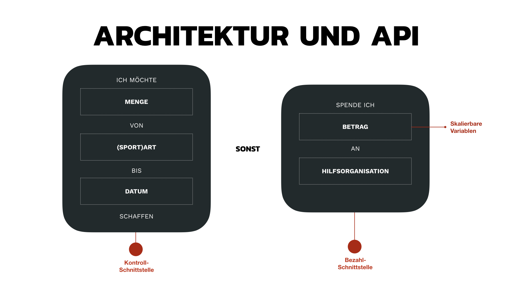
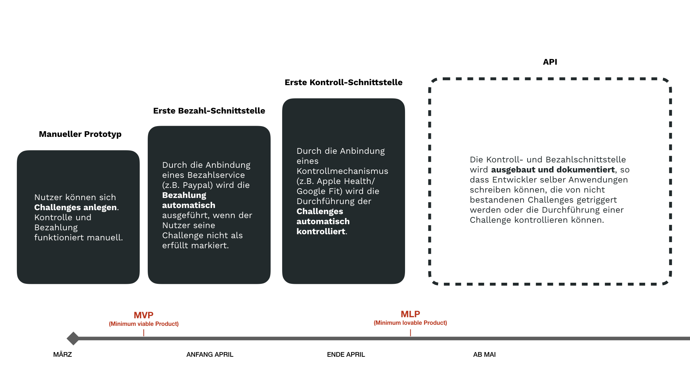

# Concept and Architecture

We plan to build an architecture that is open for other Interfaces.
Think of it as an IFTTT for challenges and donations.
In the picture you can see how we plan to develop these interfaces.
If you like to contribute to this solution feel free to start working on it or contact us.

[YouTube video](https://youtu.be/y0UAtoeRgl8) feel free to 👍

At the moment we have an Angular frontend and a lot of ideas to implement.

Please follow our [code of conduct](https://github.com/MalteRei/wirvsvirus-hackathon-spendensport/blob/master/CODE_OF_CONDUCT.md) 👨‍👩‍👧‍👦

If you want to contribute feel free to contact us (we will be happy to add you as a contributor) or have a look at our [contribution guidline](https://github.com/MalteRei/wirvsvirus-hackathon-spendensport/blob/master/CONTRIBUTING.md) 👩🏼‍💻👨🏼‍💻
